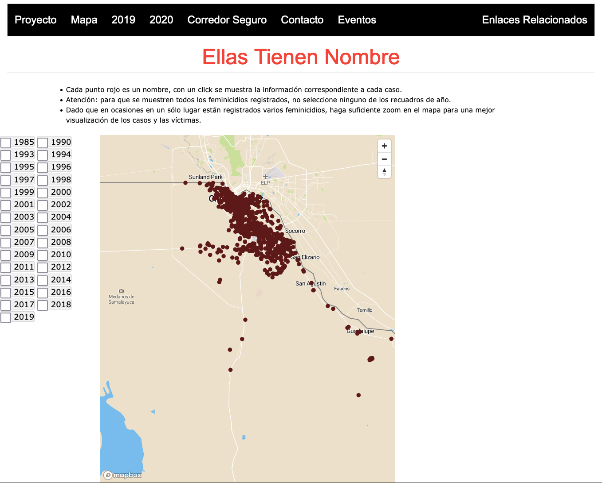

Ellas Tienen Nombre (“They Have Names”) is an independent-scholar led project to gather public data and document murdered women and girls in Ciudad Juárez, Mexcio, through mapping and visualization. 

The objective of this feminist mapping project is to focus on the victims of femi(ni)cide, monitoring and georeferencing the places where the bodies of murdered girls and women have been found, as well as breaking down the specificities and data of each of the cases. The project arises from the idea that this information should be available to all types of audiences interested in the subject and with internet access. Due to a political-ideological stance related to the historical context of Ciudad Juárez regarding feminicides, so far, this project has not searched for or received funds or financial support.  

[View Project »](https://www.ellastienennombre.org/)

---




    

    <h4 style="font-weight: bold;">{{ person.name }}</h4>
    {{ person.person_title }}
     
      
    {{ person.bio }}   



