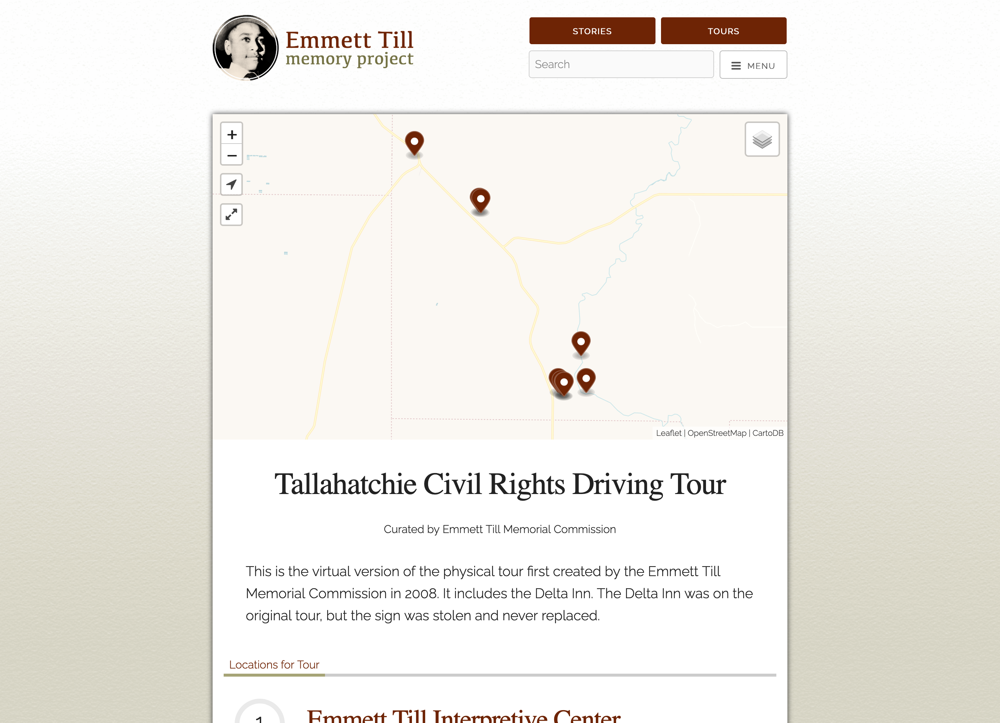

The Emmett Till Memory Project is a collaborative production of the Emmett Till Memorial Commission of Tallahatchie County, Mississippi, and scholars across the country. 

The project, which exists as a web page and a mobile app, is a complete guide to the legacy of Till’s murder. The app takes users to the most important sites in the Mississippi Delta and beyond. At each site, the app provides expert-vetted narratives, access to relevant archival documents, and a collection of historic and contemporary photographs. The ETMP teaches users what happened at each site in 1955 and how the sites have been commemorated since 1955. By telling Till’s story from the perspective of each site, the app encourages users to wrestle with different versions of Till’s story and think critically about how it has been passed on.  

The Emmett Till Memory Project has been named by the National Humanities Alliance as a top 5% public project in the country.  

[View Project »](https://tillapp.emmett-till.org/)

---




    

    <h4 style="font-weight: bold;">{{ person.name }}</h4>
    {{ person.person_title }}   



