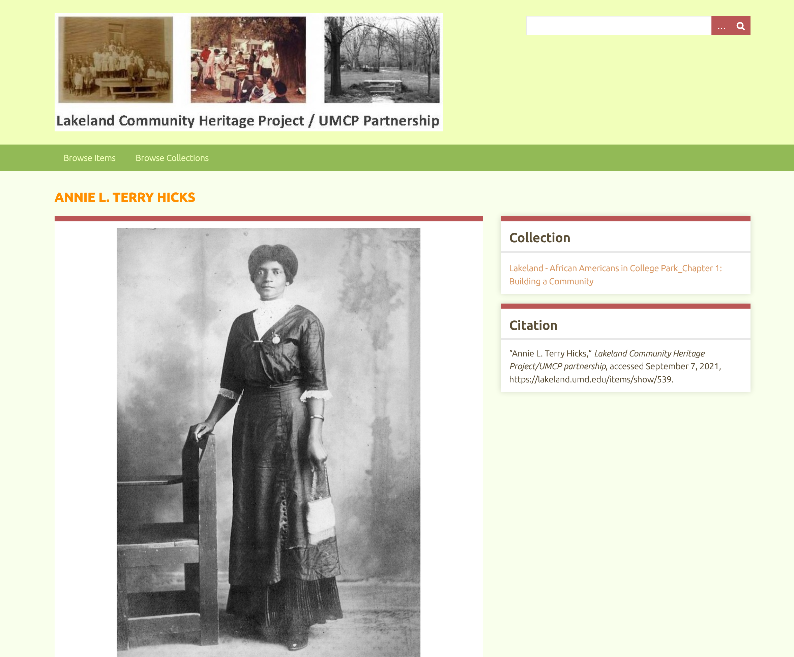

The Lakeland Community Heritage Project Digital Archive is a collaboration between the Lakeland Community Heritage Project (LCHP), an all-volunteer historical society, and partners at the University of Maryland.

The digital archive project builds upon LCHP's many years of work to document an historic African American community before and after segregation and contribute to an understanding of urban renewal's impact on communities of color. Lakeland is an historic African American community established in 1890 and located in College Park, MD, adjacent to the University of Maryland campus. 

The partnership provides LCHP with student and faculty labor to help document and archive Lakeland's history, while training students in an ethical and equitable practice of collaborative heritage research wherein Lakelanders produce historical knowledge using their own voices. The Archive contains photographs, land records, census data, newspaper clippings, maps, dozens of oral history sound files, archival records, and video recordings. 

#### [View Project »](https://mith.umd.edu/research/lakeland/)  

---




    

    <h4 style="font-weight: bold;">{{ person.name }}</h4>
    {{ person.person_title }}    


