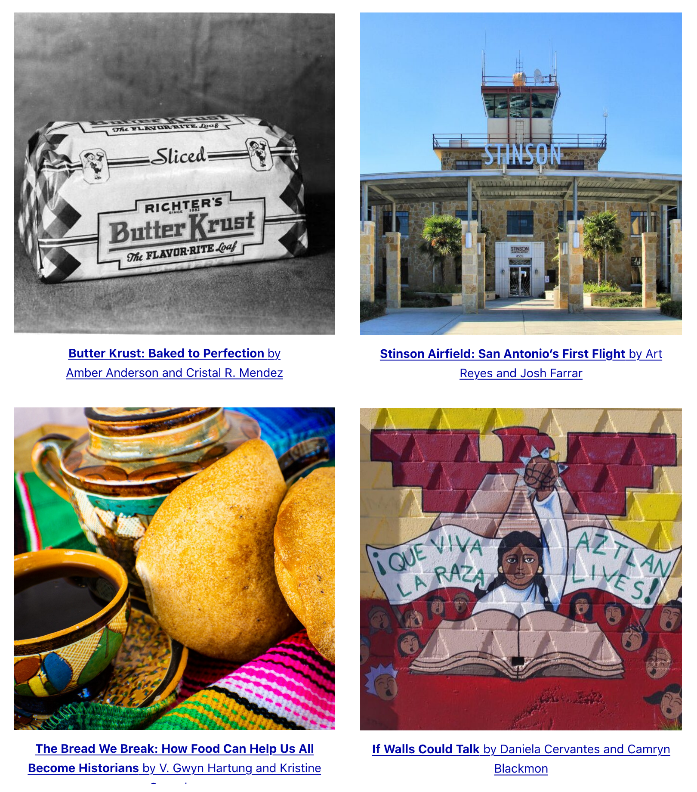

The San Antonio Storyscapes (SASS) project is a partnership between the San Antonio Office of Historic Preservation and the Public History program at St. Mary’s University to produce student-created, place-based digital projects that address gaps in the historic record. 

In Spring 2020 and 2021, the City of San Antonio’s Office of Historic Preservation (OHP) ScoutSA team, led by Dr. Jenny Hay, partnered with Dr. Lindsey Wieck and her St. Mary’s University graduate Digital Public History course. Together, we challenged Wieck’s students to produce innovative digital projects for the OHP using a consultant-in-training model to create a project-based learning experience. As a Hispanic-Serving Institution, our Public History program uses projects like these to provide opportunities to ensure our predominantly BIPOC students can grow as knowledge producers, providing space to them to tell stories of populations largely overlooked by scholars. 

Based on the City’s database of historic sites, including landmarks and districts, and their own original research, the students produce place-based projects that address gaps in the historic record. The SASS site showcases their efforts to approach this challenge with critical and nuanced perspectives: <https://stmupublichistory.org/sass/>.  

[View Project »](https://www.ellastienennombre.org/)

---




    

    <h4 style="font-weight: bold;">{{ person.name }}</h4>
    {{ person.person_title }}
     
      
    {{ person.bio | markdownify }}   



