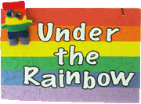

*Under the Rainbow: Oral Histories of Gay, Lesbian, Bisexual, Transgender, Intersex and Queer People in Kansas* is a series of interviews that documents the life stories and experiences of GLBTQ Kansans. It is the first online open access oral history collection of GLBTQ Kansans in the U.S.  

#### [View Project »](http://hdl.handle.net/1808/5330)  




    

    <h4 style="font-weight: bold;">{{ person.name }}</h4>
    {{ person.person_title }}   


